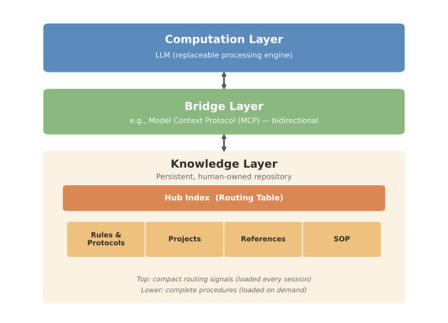
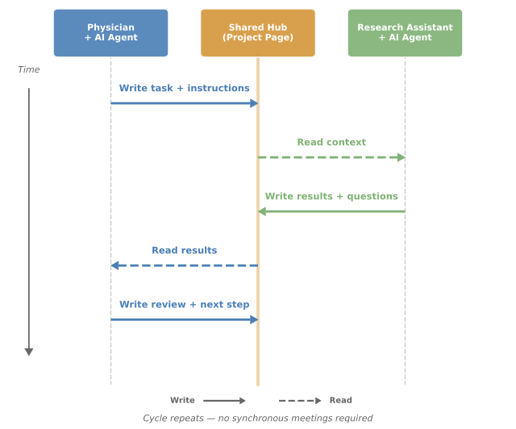

# Cognitive Hub

**Externalized living memory for AI agents in knowledge-intensive professional work.**

A structured knowledge base — human-readable, AI-readable, and collaboratively editable — that gives AI agents persistent, auditable context.

> 🌐 [繁體中文版](README.zh-TW.md)

---

## The Problem

Clinicians and knowledge workers accumulate substantial domain knowledge over time. The bottleneck is not any single task but the **cumulative erosion of decision context** — across tasks, over time, and between collaborators.

A week after a committee decision, you may no longer recall which alternatives were weighed or why one was favored. This is not a personal failing; it is a structural constraint of finite working memory: context that is not externalized will be lost.

Current AI tools focus on **doing things for you** (writing, scheduling, automating). That solves "not enough hands." But for professionals who accumulate deep domain knowledge, the real bottleneck is **not enough brain**:

- Decision context erodes over time — the same deliberation repeats
- Past decisions and rationale are not systematically recorded
- Team members lack shared decision memory
- AI starts from zero every conversation — powerful but amnesic

**Cognitive Hub addresses this by making memory precede action:** before AI agents can act meaningfully, they need persistent, human-controlled context.

## What Is Externalized Living Memory?

The approach is called *externalized living memory* because of three attributes:

- **Externalized**: knowledge resides in a structured system, not in transient AI sessions or the user's working memory
- **Living**: the knowledge grows, is corrected, and undergoes pruning — and an AI agent reasons over it at query time, cross-referencing across domains in ways no static document can
- **Multi-agent accessible**: the same knowledge base is readable and writable by both humans and AI agents, including team members

Three properties distinguish it from existing tools:

1. **No-code accessible** — implementable with standard note-taking platforms
2. **Vendor-neutral** — independent of any specific LLM
3. **Extensible by design** — platform vendors can automate what is currently manual

## Architecture

Cognitive Hub is a **design pattern**, not a product. It can be implemented with any combination of LLM + structured knowledge platform + bridging protocol. The reference implementation uses Claude + Notion + MCP, but nothing in the design requires these specific tools.

### Layered Architecture

The approach organizes knowledge into three layers:



```
┌─────────────────────────────────────────────┐
│         Computation Layer (LLM)             │
│   Replaceable processing engine.            │
│   Reasons over knowledge but does not own   │
│   it. Switching providers causes no loss.   │
└──────────────────┬──────────────────────────┘
                   │ bidirectional
┌──────────────────┴──────────────────────────┐
│          Bridge Layer (e.g., MCP)           │
│   Bidirectional connectivity between        │
│   knowledge platform and AI engine.         │
│   Tool-agnostic by design.                  │
└──────────────────┬──────────────────────────┘
                   │
┌──────────────────┴──────────────────────────┐
│          Knowledge Layer (Hub)              │
│   Persistent, human-owned repository:       │
│   ├── Rules & Protocols — decision logic    │
│   ├── Projects — evolving work context      │
│   ├── References — stable background info   │
│   └── SOP — step-by-step procedures         │
│                                             │
│   + Hub Index (routing table)               │
│   + Governance hierarchy                    │
└─────────────────────────────────────────────┘
```

### Hub Index as Routing Table

The knowledge layer maintains a top-level index that functions as a routing table. It lists subsections with one-line summaries and trigger conditions. The AI reads **only this index** at conversation start, then selectively loads relevant subsections on demand. Context windows are finite, but the knowledge base can grow indefinitely. The routing table allows scaling without degradation.

### Governance Hierarchy

The knowledge layer employs a governance hierarchy mirroring constitutional law:

- **Top layer**: compact, stable, loaded at every session — contains only routing signals
- **Lower layers**: complete procedures, loaded on demand

Promoting a rule upward requires a high threshold: only high-frequency, cross-session signals expressible in one line qualify. This prevents top-layer inflation, which degrades routing accuracy and wastes context budget.

### Dual-Layer Visibility

For privacy, the system separates:

- **Personal hub** (strategic reasoning, management judgments): accessible only to the author and AI
- **Collaborative layer** (task-level information): shared with team members

This is a pragmatic measure. Institutions should evaluate local data protection compliance.

## Design Principles

Five principles guide construction and maintenance:

1. **Serve both human and AI readers.** Every piece of knowledge should be simultaneously comprehensible to a human reviewer and parseable by an AI agent. This ensures full auditability.
2. **Separate knowledge from computation engine.** The knowledge layer must not depend on a specific LLM. Knowledge is the durable asset; the LLM is a consumable.
3. **Manage AI with proven human management principles.** The system adopts organizational practices — delegation, SOPs, onboarding — and applies them to AI behavior.
4. **The data layer outlives the tool layer.** Platforms change. The knowledge structure must be portable. Markdown-based, plain-text-compatible formats ensure survivability.
5. **Promote routing signals, not full procedures.** When a rule earns top-level importance, only a one-line pointer is promoted. The complete procedure stays in its dedicated page.

## Key Capabilities

### Persistent Decision Memory

When you return to a project days or weeks later, the AI already knows what you decided, why, and what's pending — without re-briefing.

### Rule-Driven Behavior

Instead of hoping the AI "gets" your preferences, you write explicit rules: communication style, decision frameworks, research protocols. The AI reads and follows them.

### Async Relay Workflow

A collaboration pattern for small teams: the lead outlines a task in the hub → a team member picks it up using their own AI agent (which reads the shared project page for context) → completes the portion → updates the page → the lead reviews and adds the next subtask. The project advances through multiple relay cycles without synchronous meetings.



### Settle-Then-Generate Pattern

A working pattern that emerged naturally: settle the substance in the hub first, then generate the deliverable. This reduces wasted iterations because every intermediate decision is recorded and reviewable.

## Comparison With Existing Approaches

| Dimension | PKM | AI Agents | LLM Memory | Custom GPTs | Institutional RAG | Living Memory |
|---|---|---|---|---|---|---|
| Memory model | Human-designed | Agent-managed | Agent-managed | Static upload | Static documents | Human-designed |
| AI accessibility | None | Full | Full | Read-only | Read-only | Read-write |
| Dynamism | Manual update | Auto-logged | Auto-summarized | Static | Static | Living (curated) |
| Platform independence | Portable | Locked | Locked | Locked | Locked | Portable |
| Controllability | Full | Limited | Partial* | Partial | Limited | Full |
| Setup requirement | Manual | Engineering | None | Low | Engineering | No-code |
| Team collaboration | Limited | Emerging | None | None | Org-wide | Multi-user |

*Recent LLM memory features allow users to view, edit, and delete individual memories. However, these systems lack structural organization (no hierarchy, routing, or governance) and remain platform-locked.

## Templates

The `templates/` directory contains de-identified example templates:

- **`rules-template.md`** — A starter Rules page showing how to structure decision logic for AI consumption
- **`project-template.md`** — An Async Relay Workflow project page with goals, approach, role assignments, checklist, and lessons learned
- **`sop-template.md`** — A Standard Operating Procedure template for recurring workflows
- **`sync-notion-backup.py`** — A Python script that exports Hub pages from Notion to local markdown files, providing offline access and vendor-neutral portability

These are starting points. Adapt freely to your own roles, tools, and working style.

## Getting Started

You need two things:

1. **An LLM with external knowledge access** — Claude with Notion MCP, or any LLM that can read/write to an external knowledge platform
2. **A structured knowledge platform** — Notion, Obsidian, Confluence, or any tool that supports structured pages with AI access

Setup takes under an hour:

1. Create your Hub page with sub-sections: Rules, Projects, References, SOP
2. Create a Hub Index (routing table) listing each section with a one-line summary and trigger condition
3. Write 5–10 core rules (communication style, decision principles, behavioral guidelines)
4. Add basic references (who you are, what roles you hold, your tools and preferences)
5. Configure your LLM to read the Hub Index at conversation start
6. Test with: *"What do you know about my current projects?"*

## Limitations

- **Single-team validation.** Developed and tested by one team in one institution. A design case study, not a controlled evaluation.
- **Maintenance overhead.** The Hub requires active upkeep (~15 min/day in the author's experience). An outdated Hub is worse than no Hub.
- **Platform-dependent bridging.** While the design is tool-agnostic, the bridging layer depends on specific platform support. Not all combinations have mature bridges yet.
- **Privacy considerations.** Connecting an LLM to your knowledge base means the provider processes that content. Dual-layer visibility mitigates but does not eliminate this concern.
- **Top-layer inflation risk.** Without promotion discipline, the routing layer grows until it degrades accuracy.
- **Not a replacement for institutional systems.** This is a personal/small-team productivity architecture.

## 📄 Paper

The design pattern and clinical case study are described in a peer-reviewed manuscript currently under review:

> Lee WJ, Wu CF. Externalized Living Memory: Structuring Clinical Knowledge for the Age of AI Agents. *J Med Internet Res*. Preprint. doi:[10.2196/preprints.96809](https://doi.org/10.2196/preprints.96809)

The paper uses health care as its case study, but the design pattern is domain-agnostic and applies to any knowledge worker managing multiple roles or accumulating substantial domain knowledge.

## Relationship to Other Memory Systems

Projects like [OpenClaw](https://github.com/anthropics/openclaw) demonstrate that AI agents need persistent memory. Cognitive Hub explores the same problem from a different angle: instead of a full-stack agent platform with Docker containers, boot files, and scheduled tasks, it uses **existing no-code tools** (a note-taking app + an LLM with bidirectional access) to achieve persistent, auditable context.

The two approaches are complementary, not competing:

- **OpenClaw** excels at always-on execution: scheduling, mobile messaging, 24/7 autonomous tasks
- **Cognitive Hub** excels at deep context: structured decision memory, cross-role knowledge, on-demand retrieval without context window limits

You can use either independently, or both together — Hub as the thinking layer, an agent platform as the execution layer. Choose the tools that fit your workflow.

## Citation

```bibtex
@article{lee2026externalized,
  author       = {Lee, Wen-Jeng and Wu, Chiung-Fang},
  title        = {Externalized Living Memory: Structuring Clinical
                  Knowledge for the Age of AI Agents},
  journal      = {Journal of Medical Internet Research},
  year         = {2026},
  note         = {Preprint},
  doi          = {10.2196/preprints.96809},
  url          = {https://doi.org/10.2196/preprints.96809}
}
```

See `CITATION.cff` for machine-readable citation metadata.

## License

This work is licensed under Creative Commons Attribution 4.0 International (CC BY 4.0).

You are free to share and adapt this material for any purpose, including commercial, as long as you give appropriate credit.

## Author

**Wen-Jeng Lee, MD, PhD**
Department of Medical Imaging, National Taiwan University Hospital
