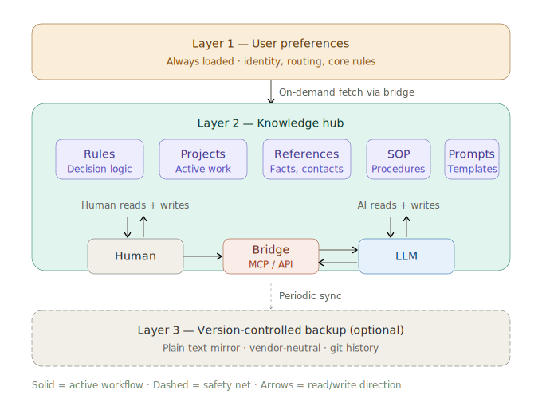

# Cognitive Hub

[](https://creativecommons.org/licenses/by/4.0/)

**A memory-first design pattern for AI agents in multi-role knowledge work.**

Externalized living memory that is human-readable, AI-readable, and collaboratively editable.

> 🌐 [繁體中文版](README.zh-TW.md)

---

## The Problem

Knowledge workers — physicians, researchers, managers, lawyers, engineers — don't struggle because they can't find information. They struggle because they carry too many roles at once.

You make a decision as a researcher in the morning, switch to administration in the afternoon, and return to that research context three days later — but you've already forgotten which options you considered, what you ruled out, and why. This isn't a memory problem. It's a fundamental cognitive limitation: humans can only maintain a few active working contexts, and switching roles erases the previous one.

Recent developments in AI agents have focused on **autonomous task execution** — agents that write emails, manage calendars, run shell commands, and orchestrate multi-step workflows on your behalf. This solves "not enough hands." But for multi-role knowledge workers, the real bottleneck is **not enough brain**:

- Cross-role context loss when switching between responsibilities
- Lessons and decisions not systematically accumulated — the same mistakes recur
- Team members lack shared decision memory, increasing communication overhead
- AI starts from zero every conversation — you re-explain your background each time

**Cognitive Hub addresses "not enough brain" — it makes AI your cognitive partner, not just your task executor.**

## Architecture

Cognitive Hub is a **design pattern**, not a product. It can be implemented with any combination of LLM + structured knowledge platform + bridging layer. The reference implementation uses Claude + Notion + MCP, but nothing in the design requires these specific tools.

### 3-Layer Memory Architecture



```text
Layer 1 — User Preferences (always loaded)
├── Written into the LLM's system prompt or user preferences
├── Core identity, communication rules, routing instructions
├── Minimal footprint — loaded at every conversation start
└── Tells the AI: "go read my Hub for context"

Layer 2 — Knowledge Hub (loaded on demand)
├── Suggested sections (adapt to your own needs):
│   ├── Rules      — decision logic and principles
│   ├── Projects   — active work with status and context
│   ├── References — facts, contacts, task sources
│   ├── SOP        — step-by-step procedures for recurring tasks
│   └── Prompts    — reusable prompt templates
└── Structure is flexible — add, rename, or reorganize as your work evolves

Layer 3 — Version-Controlled Backup (optional)
├── Plain text (.md) mirror of the Hub
├── Vendor-neutral insurance
└── Git history provides change tracking
```

**How it works:** Layer 1 is written into the LLM's system prompt (or equivalent configuration such as user preferences or custom instructions), so it loads automatically at every conversation start. Layer 1 contains a brief instruction telling the AI to check the Hub for context. The AI then fetches only the Layer 2 pages relevant to the current task via a bridging layer (e.g., MCP or API) and responds with full context. Layer 3 is a safety net, not part of the active workflow.

### Key Design Decisions

**Memory-first, not action-first.** Most AI agent frameworks optimize for autonomous task execution — the AI does things on your behalf. Cognitive Hub inverts this: the knowledge layer comes first, and actions are grounded in shared, structured context. The AI doesn't just do — it *understands*.

**Explicit over implicit.** Rules, decisions, and workflows are written down in structured pages — not buried in conversation history or inferred by the AI. You can read, edit, and share them. When you change a rule, the AI's behavior changes immediately.

**Human-AI co-maintained.** The Hub is not a static document uploaded once. Both the human and the AI read and write to it. The AI might suggest updating a rule after a new decision; the human reviews and approves. Over time, the Hub grows into a living record of how you work.

**Tool-agnostic.** The design pattern — layered memory, explicit rules, async relay — works on any platform. If you switch from Notion to Obsidian, or from Claude to another LLM, your accumulated knowledge moves with you.

## Key Capabilities

### Cross-Role Decision Memory

When you switch from researcher to administrator to clinician, the AI already knows what you decided in each role, why, and what's pending. No re-explanation needed.

### Rule-Driven Behavior

Instead of hoping the AI "gets" your preferences, you write explicit rules: communication style, decision frameworks, research protocols, administrative procedures. The AI reads and follows them.

### Async Relay Workflow

Because the Hub's memory is externalized — stored outside any single AI session — it is naturally accessible to both the human and the AI. This same property extends to teams: when knowledge lives in a shared external platform, multiple team members can read and write to the same knowledge base alongside the AI. The Async Relay Workflow leverages this: the lead ideates with AI → creates a shared knowledge page (goals, approach, checklist, lessons learned) → hands off to team members who continue independently with their own AI sessions, all grounded in the same shared context. No meetings required to maintain alignment.

### Extensible Integration

With an externalized memory platform at the center, connecting additional services becomes straightforward. Through bridging layers (MCP, API), the Hub can integrate with email, calendars, voice memo transcription, task management, and other productivity tools. The AI doesn't just access these services mechanically — it applies your preferences, priorities, and decision logic stored in the Hub when interacting with them.

## Illustrative Context

The reference implementation was developed by a department chief at a teaching hospital who simultaneously manages clinical interpretation, academic research, departmental administration, team coordination, teaching, and technology development. These six roles generate a constant stream of fragmented decisions, rules, and pending items across different tools and timeframes.

Rather than building separate systems for each role, Cognitive Hub provides a single knowledge architecture where all roles share the same memory layer. The AI can surface relevant context from any role at any time — a research decision informs an administrative memo, a clinical observation triggers a publication-readiness assessment, a team delegation page captures lessons that prevent future mistakes.

This context is illustrative, not prescriptive. The architecture applies to any knowledge worker juggling multiple responsibilities.

## Comparison with Existing Approaches

### vs. Personal Knowledge Management (PKM)

Methods like Zettelkasten, PARA, and Building a Second Brain focus on how *humans* organize knowledge. They don't include AI read/write capabilities. Cognitive Hub adds bidirectionality: humans write and AI reads; AI writes and humans review. The knowledge base serves two audiences simultaneously.

### vs. Action-First AI Agents

Popular agent frameworks prioritize autonomous task execution — the AI runs shell commands, sends messages, manages files. Memory is a byproduct (conversation history, skill directories). Cognitive Hub inverts this: structured memory is the foundation, and actions are grounded in it. Rules, decision history, team roles, and research strategies are explicit and editable — not implicit in chat logs.

| Dimension | Action-First Agents | Cognitive Hub |
|---|---|---|
| Core focus | Autonomous task execution | Knowledge-augmented decision support |
| Memory model | Implicit (conversation history) | Explicit (layered, co-maintained) |
| Rule system | Skills (task-oriented) | Rules / SOP / Protocols (decision-oriented) |
| Team collaboration | Single-user | Multi-user shared knowledge base |
| Target user | Developers / power users | Knowledge workers (no CLI required) |
| Setup complexity | Runtime + Docker + messaging platform | Knowledge platform account + LLM account + bridge |

### vs. Built-in LLM Memory

Major LLMs now offer memory features, but these memories are: auto-extracted by the AI with limited user control; invisible to team members; flat (no layered architecture); and locked to a specific platform. Cognitive Hub's externalized memory is user-controlled, structured, shareable, and portable across LLM providers.

### vs. Custom GPTs / Claude Projects / Gems

These allow uploading static documents as context. Cognitive Hub's memory is dynamic — every conversation can update rules, add projects, or modify SOPs. Through bridging layers (MCP, API), the AI doesn't just read documents but actively writes back to the knowledge base.

## Templates

The `templates/` directory contains de-identified example templates demonstrating the design pattern:

- **`rules-template.md`** — A starter Rules page showing how to structure decision logic for AI consumption
- **`project-template.md`** — An Async Relay Workflow project page with goals, approach, role assignments, checklist, and lessons learned
- **`sop-template.md`** — A Standard Operating Procedure template for recurring workflows

These are starting points. Adapt freely to your own roles, tools, and working style.

## Getting Started

You need two things:

1. **An LLM with external knowledge access** — Claude with Notion MCP, ChatGPT with plugins, or any LLM that can read/write to an external knowledge platform
2. **A structured knowledge platform** — Notion, Obsidian, Confluence, or any tool that supports structured pages with AI access

Setup takes under an hour:

1. Create your Hub page with sub-sections (e.g., Rules, Projects, References, SOP — or whatever categories fit your work)
2. Write 5–10 core rules (communication style, decision principles, what the AI should never do)
3. Add basic references (who you are, what roles you hold, your tools and preferences)
4. Write a short Layer 1 instruction in your LLM's system prompt or user preferences, telling the AI to check the Hub at conversation start
5. Test with: *"What do you know about my current projects?"*

For detailed step-by-step guides:

- **English:** `docs/setup-guide-en.md` *(coming soon)*
- **繁體中文:** `docs/setup-guide-zh-TW.md` *(coming soon)*

## Design Principles

These principles informed the architecture and are documented here for reproducibility:

1. **The audience for notes has changed.** In the AI era, notes serve both humans and AI. The knowledge system must be readable and writable by both.
2. **Store for AI, render for humans.** During capture, optimize for information density and decision logic. When humans need to read, the AI generates a formatted version on demand.
3. **Cognitive Twin: separate knowledge from compute.** The LLM is a replaceable computation engine. Your decision logic, management principles, and research frameworks must exist independently of any specific model.
4. **Human value is in defining problems, not operating AI.** As AI lowers execution costs, operational skills commoditize. The irreplaceable contribution is: defining valuable problems, setting evaluation criteria, validating results.
5. **Data layer outlasts tool layer.** Tools have shorter lifespans than knowledge. The knowledge base must not depend on any single tool.

## Limitations

- **Single-team validation.** This architecture has been developed and tested by one team in one institution. Broader adoption across different domains and team sizes would further demonstrate its generalizability.
- **No formal user study.** Usage outcomes are based on the author's experience. Formal evaluation with structured metrics is a natural next step for future research.
- **Platform-dependent bridging.** The bridging layer (e.g., MCP) depends on specific platform support. The ecosystem is maturing rapidly, and more LLM + knowledge platform combinations are gaining bridge support over time.
- **Maintenance as a feature.** The Hub requires active upkeep — but this is by design. The act of maintaining and reviewing the Hub is itself a form of reflective practice that reinforces knowledge accumulation.

## Citation

```bibtex
@misc{lee2026cognitivehub,
  author       = {Lee, Wen-Jeng},
  title        = {Cognitive Hub: A Memory-First Design Pattern for
                  AI Agents in Multi-Role Knowledge Work},
  year         = {2026},
  publisher    = {GitHub},
  url          = {https://github.com/wenjenglee/cognitive-hub}
}
```

See `CITATION.cff` for machine-readable citation metadata.

## License

This work is licensed under [Creative Commons Attribution 4.0 International (CC BY 4.0)](https://creativecommons.org/licenses/by/4.0/).

You are free to share and adapt this material for any purpose, including commercial, as long as you give appropriate credit.

## Author

**Wen-Jeng Lee, MD, PhD**
Department of Medical Imaging, National Taiwan University Hospital

[](https://orcid.org/0000-0003-3267-4811)
